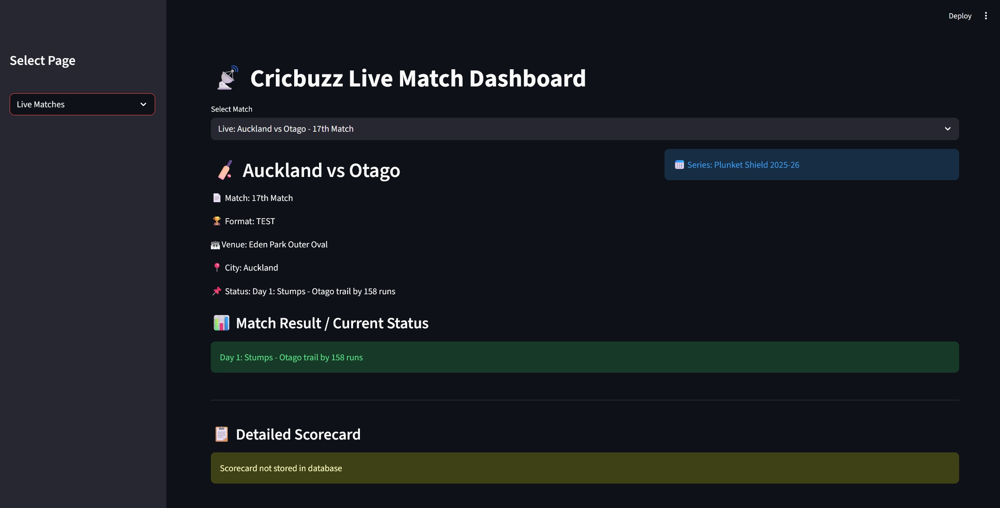
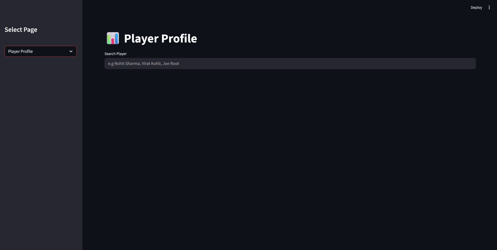
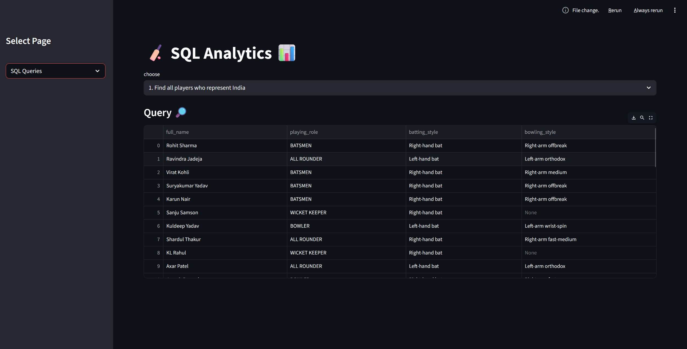
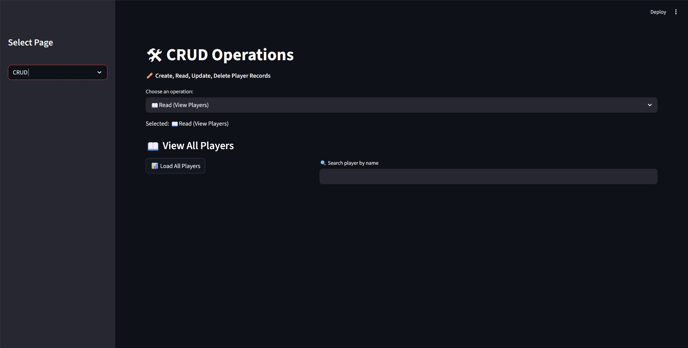

🏏 Cricbuzz LiveStats
Real-Time Cricket Insights & SQL-Based Analytics

An interactive cricket analytics dashboard built using **Python, Streamlit, MySQL, and Cricbuzz API**.

This project provides real-time cricket match updates, player statistics, and advanced SQL analytics through an intuitive web interface.

---


## Dashboard Preview


### Live match


### Player Profile


### SQL Analysis


### CRUD



📌 Project Features

### 1️⃣ Live Match Page

* Fetches real-time match data from Cricbuzz API
* Displays:

  * Live score
  * Batting statistics
  * Bowling statistics
  * Match status
  * Venue details

---

### 2️⃣ Top Player Stats Page

Shows top cricket player performances including:

* Most Runs
* Highest Score
* Most Wickets
* Best Bowling Figures

---

### 3️⃣ SQL Analytics Page

Includes **25 analytical SQL queries** categorized into:

#### Beginner

* SELECT, WHERE, GROUP BY, ORDER BY

#### Intermediate

* JOINs, Subqueries, Aggregations

#### Advanced

* Window Functions, CTEs, Complex Analytics

---

### 4️⃣ CRUD Operations Page

Allows full database management:

* ➕ Create records
* 📖 Read records
* ✏ Update records
* ❌ Delete records

---

🛠 Tech Stack

| Technology | Usage               |
| ---------- | ------------------- |
| Python     | Backend Programming |
| Streamlit  | Web Dashboard       |
| MySQL      | Database            |
| Pandas     | Data Processing     |
| REST API   | Cricbuzz Data       |
| JSON       | API Handling        |

---

📂 Project Structure

```
Cricbuzz-LiveStats
│
├── app.py
├── pages/
│   ├── Live_Match.py
│   ├── Top_Player.py
│   ├── SQL_Analytics.py
│   ├── CRUD_Operations.py
│
├── utils/
│   ├── db_connection.py
│   
│
├── requirements.txt
└── README.md
```

---

⚙ Installation

1️⃣ Clone the repository

```
git clone https://github.com/Rishabh16102003/cricbuzz-livestats.git
```

2️⃣ Install dependencies

```
pip install -r requirements.txt
```

3️⃣ Configure API Key

Create a `.env` file:

```
API_KEY=your_cricbuzz_api_key
```

4️⃣ Run the app

```
streamlit run main.py
```

---

📊 SQL Analytics

| Level        | Queries |
| ------------ | ------- |
| Beginner     | 1–8     |
| Intermediate | 9–16    |
| Advanced     | 17–25   |

---

🎯 Business Use Cases

* Sports Media & Broadcasting
* Fantasy Cricket Platforms
* Cricket Analytics Firms
* Educational SQL Learning
* Sports Data Analysis

---

👨‍💻 Author

**Ramesh krishna **
Python Developer | Data Analytics | SQL

---

⭐ Future Improvements

* 📊 Data Visualization Charts
* 🤖 Match Prediction Model
* 🏏 Player Comparison Dashboard
* 📈 Historical Match Analysis
